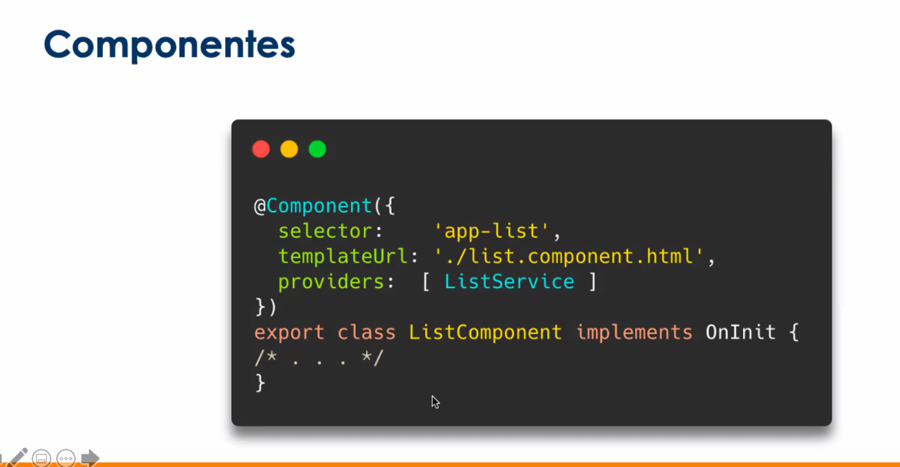
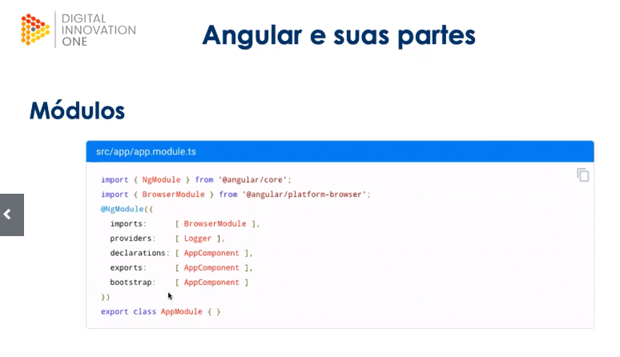

# Eduardo Gonçalves 

## Motivação e arquitetura 
Arquitetura é importante! 

- Não exagerar mantenha o ssistema simples !
- não faça além do que é necessário no momento (nao trabalhar como vidente) 
- refatorações incrementais 

- Angular : Framework fortemente organizado 
- componentes  
- diretivas
- serviços
- pipes
- modulos

- como e quando usar ?

- componentes  : Pequenas peças de dados e lógicas ligados a um templete html que define uma view 

- permitem comunicação de dados (input/output, services, store )
- toda aplicação tem ao menos um componente root , o appcomponent que se contecta diretamente com o DOM 

Selector: DIz ao angular para criar e inserir uma instancia desse como onde enocntrar a tag no template HTML 
templeta URL : arquivo HTML ou o HML inline que define a view 
- providers : Um array de dependecias que o componente precisa 

- diretivas : Provê logica para um dom ou componente existente 
- dois tipos  : estruturais e de atributos. 
- atributos modificam aparencia ou comportamento 

 Texto sublinhado 

- estruturais :  alteram a forma da estrutura do dom (* antes do nome )
<li *ngFor="let item of list"> </li>
<app-item-detail *ngIf="selectedItem" > </app-item-detail>

- componentes : componente requer uma view um template HTML 
- Componente quando quiser criar uma UI reutilizável 
- Diretiva quando quiser um comportamento reusável para estander a funcionalidade do DOM 

- Serviços : Camada que serve para colcoar lógica ou dados que não pertencem a um componente em específico ou sque deseja compartilhar essa lógica 
 - chamadas em http 
 - idenficados pelo decorator @Injectable 

- Pipes
funcoes transformadoras para operações dentro do template 
- formatadçao de moedas / data em tag 
 {{productPrice | brazilianRealCurrency }} 

- modulos 

- a mediade que o código cresce organizamos ele em módulos 
- também chamados de NgModules são um diferencial do angular 
- permitem roteamento e carregamento dinâmico 

- módulo root também chamada de AppModule 
- NgModules são diferentes dos módulos Javascript 
- possuem metadados próprios 
- funcionam com o decorator @NgModule 

- Módulos :  
- Domain ou Feature :organizada em cima de uma feature regra de negócio ou UX 
- Routing :  um módulo que confiuura rota para outros com ese modulo vc configura lazy routing 
- Routed :  um modulo roteado trbalha como destino de uma rota ou routing module 
- Service :> Prove serviços utilitarios como acesso a dados e mensageria 
- Widget  :> Faz com que um componente diretiva ou pipe fique disponível para outros módulos 
- Shared :> faz com que um conjunto de componentes diretivas e pipes fiquem disponívels para outros módulos 
- common module : parte global disponível para toda aplicação 

- Módulos Metadados 
- declarations : componentes diretivas e pipes que pertencem a este módulo 
- exports : O subconjunto de declarações que podem ser visíveis e utilizáveis em outros módulos 
- Imports : Outros módulos cujas classes exportadas são necessárias por componentes nesse módulo 
- providers : Services desse módulo que contribuem para a coleção global de services (ficam disponíveis para todo o app )
- bootstrap : A  view principal da aplicação também chamada de root componente que guarda outras views da app. Apenas o Rootmodule seta essa propriedade 

## Parte 3 Style Guide e boas práticas 

- Style Guide : Conjunto de boas práticas convencionada pela comunidade do angular 
- apps robustas e padronizadas sucesso independende do tamanho 
- coloque tudo na pasta src (se mudar o nome pode dar pau )
- um componente tem 4 arquivos html css ts e spec.ts (cada componente fica em uma pasta ) 
- Regra do um : Aplique principio da responsabilidade unica a todos os  componentes serviços e outras partes 
- Componente com no máximo 400 linhas 
- funcoes com no máximo 75 linhas 

- LiFT - Localize codigo rapidamente 
- identifique rapidamente 
- mantenha a estrutura flat 
- T-DRY  CAda código deveria ter resp unida tente pq ser dry demais prejudica legibilidade 
- NAming (arquivos) lowercase separados por pontos e letras minusculas 
- nomes compostos separados por tracos 
- naming (classe) upper camelcase AppModule
- naming (seletores) Dashed case para as tags que representam componentes e lower camelcase para nomes de diretivas 
- Estrutura - Root Module dentro de /src/app com nome AppModule
- Feature modules crie cada modulo como pasta filha de app  modulos podem encapsular ou expor funcionadidades , torna mais visivel as interdependecias entre features 
- um modulo pode ser facilmente isoalado para testes 
- core module : Criar uma core para todas as classes e interfaces que sao comuns a todo o projeto e importalos apenas no app module, o idel é criar os services aqui 
- Shared Module para componentes diretivas e modulos comunis para aplicação, evite colocar services no shared module 
- Projeto exemplo : Angularflix (tem modelos antigos de trabalhar do angular nesse projeto)

